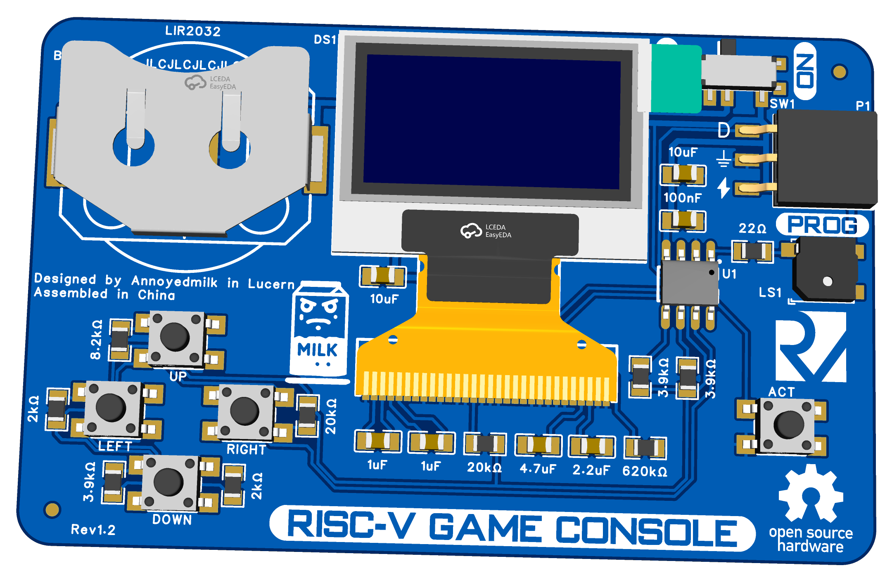

# Tiny Arcade Business Card
A pocket-sized gaming console featuring Tiny Tris and Tiny Pacman, built around the powerful CH32V003 RISC-V microcontroller.



## What Makes It Special?
The project combines the minimalism of a business card with the nostalgic charm of classic arcade games. At its heart lies the CH32V003, a remarkably capable RISC-V microcontroller that brings these timeless games to life on a crisp OLED display.

## Game Collection
- **Tiny Tris**: A carefully crafted implementation of the classic falling blocks game
- **Tiny Pacman**: Navigate mazes and outsmart ghosts in this miniaturized version

## Building Your Own

### Required Hardware
- PCB (Gerber files included)
- CH32V003 microcontroller
- 0.96" OLED display (SSD1306)
- 5 tactile switches
- LIR2032 battery holder
- Additional components listed in BOM.xlsx

### Software Setup
1. Install Visual Studio Code and PlatformIO
2. Connect your WCH-LinkE programmer
3. Clone this repository:
   ```bash
   git clone https://github.com/annoyedmilk/Business-Card.git
   ```
4. Open project in VS Code with PlatformIO
5. Build and upload:
   ```bash
   pio run -t upload
   ```

## How to Play
1. Insert a CR2032 battery
2. Power on using the switch
3. Select your game using the joystick
4. Press the action button to start
5. Enjoy classic gaming on the go!

## Project Structure
```
├── hardware/   # PCB design files
├── pictures/   # Pictures
└── software/   # Sourcecode
```

## Acknowledgments
This project stands on the shoulders of giants:

- **Stefan Wagner** ([@wagiminator](https://github.com/wagiminator)) - For the incredible CH32V003 framework that makes this project possible
- **Charles Lohr** ([@cnlohr](https://github.com/cnlohr)) - For introducing the CH32V003 to the community and developing essential tools
- **Daniel C** ([TinyJoypad](https://www.tinyjoypad.com)) - For the original game implementations that bring retro gaming to tiny hardware

## License
Released under GPL-3.0 License. Feel free to modify and share!

---

*Part of my journey learning embedded systems and keeping arcade gaming alive, one business card at a time.*
