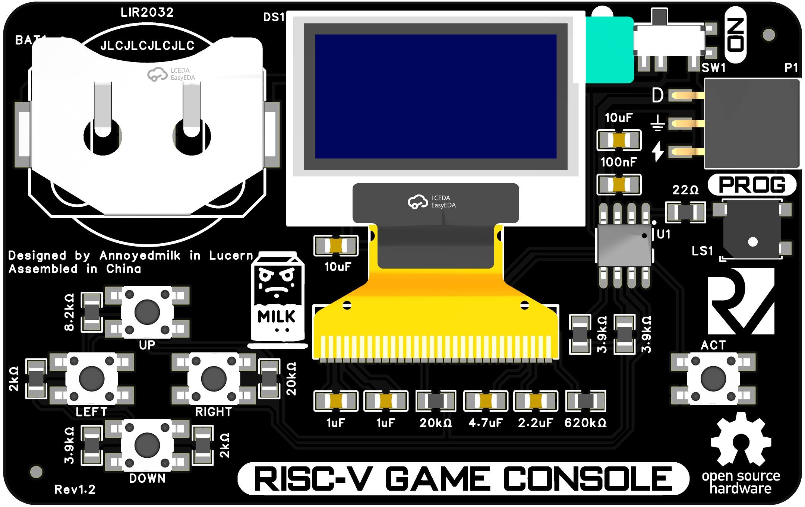

# Yet Another Tiny Arcade Business Card 🎮

Turn your pocket into an arcade with this business-card-sized gaming console! Powered by the CH32V003 RISC-V microcontroller, this project brings classic gaming to an ultra-portable form factor.



## ✨ Features

- **Ultra-Compact Design**: Fits in your wallet while packing serious gaming power
- **Powerful Brain**: Built around the CH32V003 RISC-V microcontroller
- **Crystal Clear Display**: 0.96" OLED screen (SSD1315) for crisp visuals
- **Long-lasting Power**: Rechargeable LIR2032 battery
- **Intuitive Controls**: 5 tactile buttons for precise gaming input
- **Open Source**: Full hardware and software documentation available

## 🎯 Games Library

### Tiny Tris
- Classic block-falling gameplay
- Increasing difficulty levels
- Score tracking

### Tiny Pacman
- Authentic maze navigation
- Ghost AI patterns
- Power pellets and scoring system

## 🛠️ Build Your Own

### Components Needed

- [ ] PCB (Gerber files provided)
- [ ] CH32V003 microcontroller
- [ ] 0.96" OLED display (SSD1315)
- [ ] 5 tactile switches
- [ ] LIR2032 battery holder
- [ ] Additional components (See BOM.xlsx)

### Assembly Instructions

1. Order PCB using provided Gerber files
2. Gather components from BOM
3. Follow assembly guide in documentation
4. Install firmware using one of the methods below

### Firmware Installation Options

#### Option 1: PlatformIO (Recommended)
1. Install required tools:
   - Install [Python 3.x](https://www.python.org/downloads/)
   - Install [PlatformIO IDE](https://platformio.org/install/ide?install=vscode)
   - Install platform-ch32v: 
     ```bash
     pio pkg install platform-ch32v
2. Clone and build:
   ```bash
   git clone https://github.com/annoyedmilk/Business-Card.git
   cd Business-Card
   pio run -t upload
   ```

#### Option 2: Pre-compiled Binary
- **Windows**: Use WCH-LinkUtility ([Download](https://www.wch.cn/downloads/WCH-LinkUtility_ZIP.html))
- **Cross-platform**: Use either:
  - minichlink ([GitHub](https://github.com/cnlohr/ch32v003fun/tree/master/minichlink))
  - rvprog: `pip install rvprog && rvprog -f bin/<firmware>.bin`

## 📁 Project Structure

```
├── documentation/
│   └── RenderFront.png    # Project preview
├── hardware/
│   ├── Gerber.zip         # PCB manufacturing files
│   ├── BOM.csv            # Parts list
│   └── Schematic.pdf      # Circuit diagram
└── software/
    ├── src/               # Source code
    │   ├── main.c
    │   └── ...
    └── platformio.ini     # Build configuration
```

## 🎮 Gaming Guide

1. Insert charged LIR2032 battery
2. Power on using the side switch
3. Navigate menu with direction buttons
4. Select game with action button
5. Controls:
   - Tiny Tris: Left/Right to move, Up to rotate, Down for soft drop
   - Tiny Pacman: Directional buttons to navigate, avoid ghosts!

## 🙏 Credits

This project builds on the work of amazing developers:

- **Stefan Wagner** ([@wagiminator](https://github.com/wagiminator)) - CH32V003 framework
- **Charles Lohr** ([@cnlohr](https://github.com/cnlohr)) - CH32V003 tools & community support
- **Daniel C** ([TinyJoypad](https://www.tinyjoypad.com)) - Original game implementations

## 📄 License

Released under GPL-3.0 License. Share, modify, and spread the joy of tiny gaming!

## 🔗 Useful Links

- [PlatformIO Installation](https://platformio.org/)
- [CH32V Platform Guide](https://pio-ch32v.readthedocs.io/en/latest/installation.html)
- [Python Installation Guide](https://www.pythontutorial.net/getting-started/install-python/)
- [pyenv Setup](https://realpython.com/intro-to-pyenv/)

---

*Making the world a little more fun, one tiny arcade at a time! 🕹️*
