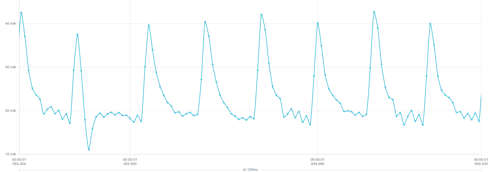

# Power Measurements: 🔌

## Setup:
- [NORDIC Power Profiler Kit II](https://www.nordicsemi.com/Products/Development-hardware/Power-Profiler-Kit-2)
- Method: Source Meter (Battery Disconnected)
- Voltage: 3.6V (for current measurements)

## Measurements: ⚖️
A bunch of different events were measured:
- Current consumption in different modes
- Current consumption of buzzer
- Current consumption of button presses
- minimum running voltage

### Current Consumption:
- Generrally a Ripple of 150us (6.6kHz) is visible. The Current ranges from approximately 20 to 40 mA. Probably something like a internal Clock / Update-Cycle.

#### Main Menu / Tetris / Pacman: 👾
- Average Current in the Main Menu at 3.6V is at 21.4mA
- Average Current in Tetris at 3.6V is at 11.86mA
- Average Current in Pacman at 3.6V is at 9.58mA

#### Buzzer: 🔊
- Average of 30-50mA 
- Peaks of 120mA

#### Button presses: 🕹️
- No difference visible

### Minimum Voltage: ⚡ 
All measurements done after Startup in Idle mode (main menu)

| **U** [V] | **I***avg* [mA] | **I***max* [mA] | Info |
| ----------- | ----------- | ----------- | ----------- |
| 3.6 | 22.18 | 44.01 | | 
| 3.5 | 21.39 | 43.9 | |
| 3.4 | 21.31 | 42.07 | |
| 3.3 | 21.38 | 41.41 | |
| 3.2 | 21.34 | 38.24 | |
| 3.1 | 21.36 | 34.99 | |
| 3.0 | 21.44 | 30.48 | |
| 2.9 | 24.01 | 28.07 | |
| 2.8 | 23.57 | 26.65 | |
| 2.7 | 22.63 | 25.67 | |
| 2.6 | x21.69 | 24.59 | |
| 2.5 | 20.95 | 23.52 | |
| 2.45 | 20.52 | 23.22 | |
| 2.4 | 15.95 | 18.46 | Errors on Display, no Buzzer. Maybe hanging |

 